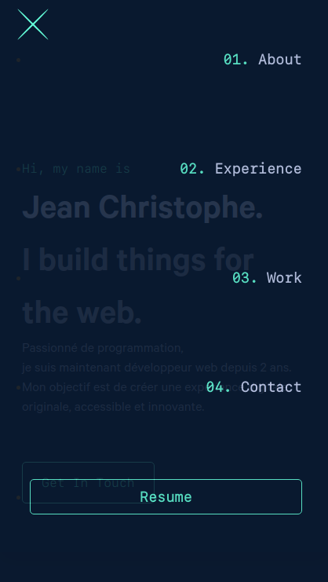

<link rel="stylesheet" type="text/css" media="all" href="./css/md.css" />

# Personnal Website

**Made from scratch in plain HTML CSS JS** and a bit of Bootstrap
 

`[ Still working on the responsive - switching bootstrap to Tailwind ]`
  

---

    <b>
      Go have a look!  
    <a href="https://jcharalamy.com">
jcharalamy.com
</a>
  </b>

## Desktop

## Mobile

    
    

